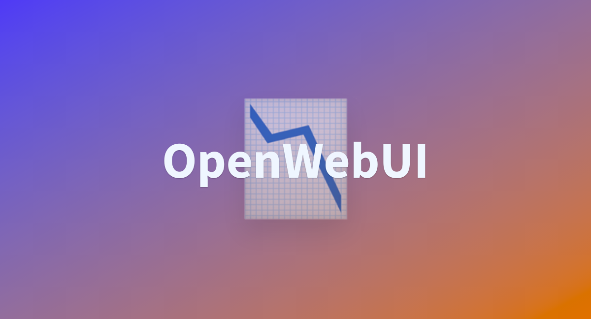

# Llama 3.2 FastAPI Integration

<div align="center">

</div>
<div align="center">



</div>
<br>

A FastAPI service that provides a comprehensive interface for Llama 3.2, featuring document processing, vector store integration, workflow automation, and a web UI.

## Features

- REST API for text generation with Llama 3.2
- Document processing and embedding support
- Vector store integration with ChromaDB
- Open WebUI interface for easy interaction
- Workflow automation with n8n
- Docker container for easy deployment
- Integration with Ollama for model management

## Quick Start

```bash
# Clone the repository
git clone https://github.com/jwill9999/llama3.2.git
cd llama3.2

# Build the services
docker-compose build

# Start the services
docker-compose up -d

# Access the services:
# - API: http://localhost:8000
# - Open WebUI: http://localhost:3000
# - n8n Workflow Automation: http://localhost:5678
# - API Documentation: http://localhost:8000/docs
```

## Alternative: Using Make Commands

```bash
# Build the services
make build

# Start the services
make up

# Access the services:
# - API: http://localhost:8000
# - Open WebUI: http://localhost:3000
# - n8n Workflow Automation: http://localhost:5678
```

## API Endpoints

- `GET /ping`: Health check endpoint
- `GET /ask?prompt=YOUR_PROMPT`: Generate a response to the given prompt
- `POST /upload`: Upload and process documents (supports multiple formats)
- `GET /documents`: List processed documents
- `POST /webhook/google-drive`: Webhook endpoint for Google Drive integration

## Supported Document Formats

- Text files (.txt)
- PDF documents (.pdf)
- Word documents (.docx)
- Markdown files (.md)
- HTML files (.html)
- Excel spreadsheets (.xlsx)
- PowerPoint presentations (.pptx)

## Docker Images

```bash
# Pull the images
docker pull jwill9999/llama3.2-api:latest
docker pull jwill9999/llama3.2-ollama:latest
docker pull docker.n8n.io/n8nio/n8n:latest

# Run the containers
docker run -p 8000:8000 jwill9999/llama3.2-api:latest
docker run -p 11434:11434 jwill9999/llama3.2-ollama:latest
docker run -p 5678:5678 docker.n8n.io/n8nio/n8n:latest
```

## Available Commands

### Basic Operations

| Command      | Description                               |
|--------------|-------------------------------------------|
| `make build` | Build the Docker images                   |
| `make up`    | Start the services in detached mode       |
| `make dev`   | Start services with console output        |
| `make down`  | Stop the services                         |
| `make logs`  | View service logs                         |
| `make restart`| Restart all services                     |

### Advanced Operations

| Command                      | Description                                |
|------------------------------|--------------------------------------------|
| `make prod VERSION=1.2.0`    | Start services with specific version       |
| `make pull VERSION=1.2.0`    | Pull images with specific version          |
| `make clean`                 | Stop services and remove volumes           |
| `make test`                  | Build and start with test version          |
| `make build-api`             | Build only the api service                 |
| `make build-ollama`          | Build only the ollama service              |
| `make push`                  | Push images to Docker Hub                  |
| `make build-hub VERSION=1.2.0`  | Pull and restart with specific version     |
| `make build-hub`  | Pull and restart latest version     |

### Versioning

| Command                         | Description                               |
|---------------------------------|-------------------------------------------|
| `make push-version`             | Tag and push all services with patch version bump      |
| `make push-version BUMP_TYPE=minor` | Bump minor version (1.0.0 → 1.1.0)   |
| `make push-version BUMP_TYPE=major` | Bump major version (1.0.0 → 2.0.0)   |

## Project Structure

```
llama3.2/
├── docker/
│   ├── fastapi/
│   │   └── Dockerfile
│   └── ollama/
│       └── Dockerfile
├── scripts/
│   ├── tag-version.sh     # Version tagging script
│   ├── build-and-tag.sh   # Build and tag script
│   └── pull-llama3.2.sh   # Pull Llama model script
├── public/
│   └── ollama.jpg         # Logo image
├── chroma_db/             # Vector store database
├── main.py                # FastAPI application
├── requirements.txt       # Python dependencies
├── compose.yml            # Docker Compose configuration
├── makefile               # Make commands
├── open-webui-config.json # Open WebUI configuration
└── VERSION                # Current version file
```

## Requirements

- Docker and Docker Compose
- An Ollama instance with the Llama 3.2 model loaded
- Google Drive API credentials (optional, for Google Drive integration)
- n8n account (optional, for workflow automation)

## License

[MIT License](LICENSE)